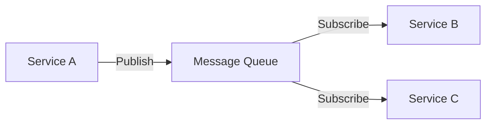
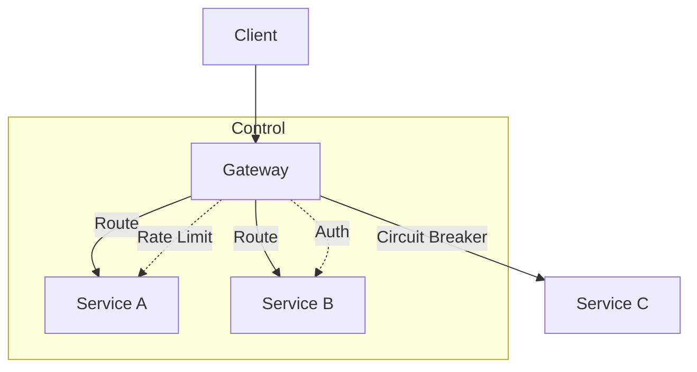

# Message Control Strategies in Real-World Microservices

Based on this microservices architecture, this document explains how message sending is controlled in real-world production systems. The current sample uses HTTP polling (ping every 10 seconds), but production systems use more sophisticated approaches.

---

## 1. Architecture Overview

### Current Implementation (HTTP Polling)

```
Service A ---HTTP POST---> Service B
Service B ---HTTP POST---> Service C
Service C ---HTTP POST---> Service A
```

- **Control Points**: Start/Stop endpoints at `/api/ping/start`, `/api/ping/stop`
- **Custom Messages**: `/api/ping/custom` endpoint with configurable payload
- **Interval**: Fixed 10-second `setInterval`
- **Target Selection**: Hardcoded service URLs

---

## 2. Message Queue Systems (Most Common)

Instead of direct HTTP calls, production systems use message brokers.

### RabbitMQ



Features:
- **Pub/Sub** - Multiple consumers can subscribe to the same queue
- **Acknowledgments** - Guaranteed delivery
- **Dead Letter Queues** - Failed messages go to a separate queue for retry
- **Message TTL** - Automatic expiration

### Apache Kafka

Features:
- **High-throughput** - Handles millions of messages per second
- **Persistence** - Messages retained on disk
- **Partitioning** - Horizontal scaling
- **Exactly-once semantics** - No duplicate messages

### AWS SQS/SNS

- **SQS** - Fully managed message queue
- **SNS** - Pub/Sub messaging
- **FIFO Queues** - Ordered message delivery

---

## 3. API Gateway / Service Mesh



### Control Features

| Feature | Purpose |
|---------|---------|
| **Rate Limiting** | Prevent overwhelming downstream services |
| **Authentication** | Verify client identity |
| **Circuit Breaker** | Stop requests when service is down |
| **Load Balancing** | Distribute traffic across instances |
| **Request Routing** | Route to specific service versions |

---

## 4. Production Control Features

### Circuit Breaker

Prevents cascading failures when a service is down.

```javascript
// Example: Circuit breaker implementation
class CircuitBreaker {
  constructor() {
    this.failureCount = 0;
    this.state = 'CLOSED';
  }

  async call(fn) {
    if (this.state === 'OPEN') {
      throw new Error('Circuit is OPEN');
    }
    try {
      const result = await fn();
      this.failureCount = 0;
      this.state = 'CLOSED';
      return result;
    } catch (error) {
      this.failureCount++;
      if (this.failureCount >= 5) {
        this.state = 'OPEN';
      }
      throw error;
    }
  }
}
```

### Rate Limiting

Prevents service overload.

```javascript
// Example: Rate limiter
app.use('/api', rateLimit({
  windowMs: 60000, // 1 minute
  max: 100, // 100 requests per window
  message: 'Too many requests'
}));
```

### Retry with Backoff

Handle transient failures.

```javascript
// Example: Retry with exponential backoff
async function fetchWithRetry(fn, maxRetries = 3) {
  for (let i = 0; i < maxRetries; i++) {
    try {
      return await fn();
    } catch (error) {
      if (i === maxRetries - 1) throw error;
      await sleep(Math.pow(2, i) * 1000); // 1s, 2s, 4s
    }
  }
}
```

### Message Persistence

Survive service restarts.

```javascript
// Example: RabbitMQ with persistence
const channel = await connection.createChannel();
await channel.assertQueue('myqueue', { durable: true });
channel.sendToQueue('myqueue', Buffer.from(JSON.stringify(data)), {
  persistent: true // Message saved to disk
});
```

### Idempotency

Handle duplicate messages safely.

```javascript
// Example: Idempotent processing
const processed = new Set();
async function processMessage(msg) {
  const id = msg.id;
  if (processed.has(id)) {
    return; // Already processed
  }
  processed.add(id);
  // Process message...
}
```

### Dead Letter Queue

Handle failed messages.

```javascript
// Example: Dead letter queue configuration
await channel.assertQueue('dlq', { durable: true });
await channel.assertQueue('main', {
  durable: true,
  arguments: {
    'x-dead-letter-exchange': '',
    'x-dead-letter-routing-key': 'dlq'
  }
});
```

---

## 5. Comparison: Direct HTTP vs Message Queue

| Aspect | Direct HTTP | Message Queue |
|-------|-------------|---------------|
| **Coupling** | Tight coupling | Loose coupling |
| **Persistence** | No persistence | Message persistence |
| **Delivery** | No guarantees | Delivery guarantees |
| **Backpressure** | No handling | Built-in backpressure |
| **Scalability** | Hard to scale | Easy horizontal scaling |
| **Failure Handling** | Manual retries | Automatic retry |
| **Ordering** | Not guaranteed | FIFO ordering |

---

## 6. Recommended Patterns

### Event-Driven Architecture

```
┌─────────────┐     ┌─────────────┐
│   Service   │     │   Service   │
│      A      │────▶│      B      │
└─────────────┘     └─────────────┘
       │                   │
       │    Event Bus      │
       ▼                   ▼
┌─────────────┐     ┌─────────────┐
│   Service   │     │   Service   │
│      C      │     │      D      │
└─────────────┘     └─────────────┘
```

### CQRS (Command Query Responsibility Segregation)

- **Commands** - Write operations (actions)
- **Queries** - Read operations (questions)
- Separate models for read and write

---

## 7. Tools and Technologies

| Category | Tools |
|----------|-------|
| **Message Queues** | RabbitMQ, Kafka, AWS SQS, ActiveMQ |
| **API Gateways** | Kong, Nginx, AWS API Gateway |
| **Service Mesh** | Istio, Linkerd, Consul Connect |
| **Circuit Breakers** | Hystrix, Resilience4j, Polly |
| **Observability** | Prometheus, Grafana, Jaeger |

---

## 8. Summary

The key shift in production systems is from **"push-based polling"** to **"event-driven message queues"** with proper delivery guarantees and control mechanisms.

| Current Approach | Production Approach |
|------------------|---------------------|
| HTTP polling | Message queues |
| Synchronous | Asynchronous |
| No guarantees | Delivery guarantees |
| Tight coupling | Loose coupling |
| Manual retry | Automatic retry |
| No persistence | Message persistence |

Real-world systems control message sending through:

1. **Message brokers** (Kafka, RabbitMQ) instead of direct HTTP
2. **Circuit breakers** for fault tolerance
3. **Rate limiters** to prevent service overload
4. **API gateways** for centralized control
5. **Service meshes** for traffic management
